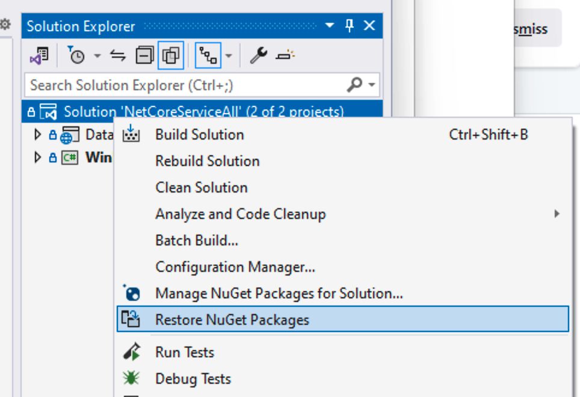

# Connect a WinForms Data Grid to a .NET Core Service

Please read [the blog post]() for details about this sample.

## Getting Started

1.	Open *NetCoreServiceAll.sln*. [Register a DevExpress NuGet feed](https://docs.devexpress.com/GeneralInformation/116698/nuget/setup-visual-studios-nuget-package-manager) in the Visual Studio IDE. Skip this step if you have already registered the DevExpress NuGet feed.
2.	Restore NuGet packages in the solution:

    
3.	Run the **DataService** project. Right-click DataService in the Solution Explorer and select **Debug** | **Start New Instance** in the menu. Your default web browser will open. 
    
    > **IMPORTANT**
    > 
    > Do not close the web browser.
4.  To initialize the sample data when you run the service for the first time, navigate to the URL `http://localhost:5146/api/populateTestData` in the open web browser. You will see the following message: *"Data populated successfully"*.
5.  Run the **WinForms.Client** project. Right-click WinForms.Client in the Solution Explorer and select **Debug** | **Start New Instance** in the menu.
6.  You can scroll to the end of the data list in the grid and observe more data being loaded. You can sort by clicking column headers. The *Output* tool window in Visual Studio displays information about the loading status from both running processes.

